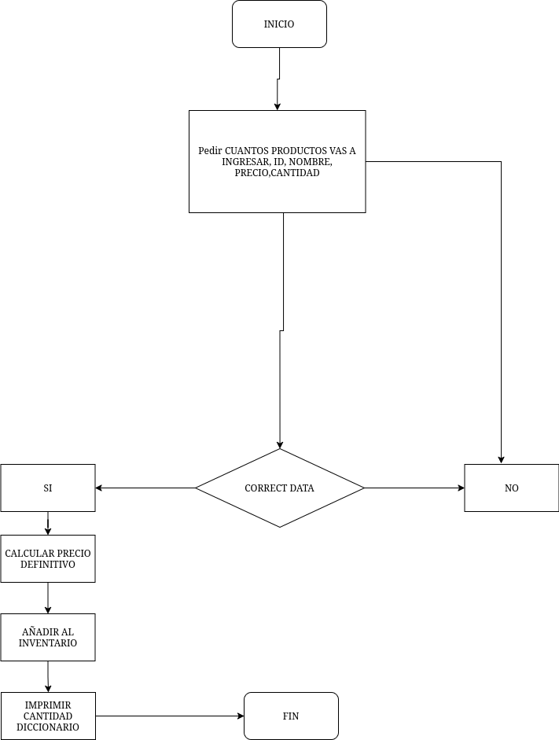

# Inventory Management System in Python

## Project Description

The system provides features to:

- Add products with **auto-generated IDs**
- View the inventory
- Update and delete products
- Calculate inventory statistics
- Save and load data using CSV files

All interactions are performed through a **terminal-based menu**.

---

## Key Features

- Automatic ID generation
- Data validation (price and quantity)
- Search products by name or ID
- Update existing products
- Delete products
- CSV data persistence
- Inventory statistics calculation
- Clean console interface (Windows & Linux compatible)

---
## Project Structure (Modular Design)
project/
-│
-├── main.py # Entry point (main menu)
-├── app.py # User interaction layer
-└── service.py # Business logic and data handling

### main.py
Handles:
- Program flow
- Menu system
- User options

### app.py
Responsible for:
- User input (`input`)
- Output display (`print`)
- Connecting UI with logic

### service.py
Contains:
- Inventory management
- ID generation
- File handling (CSV)
- Calculations

---

## 🛠 Technologies Used

- **Python 3**

### Libraries:

- `os` → Clear console
- `platform` → Detect operating system
- `pandas` → Handle CSV files

---

## ⚙️ Installation

1. Clone the repository:

- git clone <https://github.com/rgltch420/RiwiPython.git>
- cd <RiwiPython>

### main.py
Handles:
- Program flow
- Menu system
- User options

### app.py
Responsible for:
- User input (`input`)
- Output display (`print`)
- Connecting UI with logic

### service.py
Contains:
- Inventory management
- ID generation
- File handling (CSV)
- Calculations

---

### 🛠 Technologies Used

- **Python 3**

### Libraries:

- `os` → Clear console
- `platform` → Detect operating system
- `pandas` → Handle CSV files

---

## Install dependencies:
pip install pandas

## Run the main file
python main.py

## System menu
1. Add product
2. Show Inventory
3. Calculate statistics
4. Update Inventory
5. Delete Product
6. Save Data
7. Load Data
8. Exit

## How It Works
- The system stores products as a list of dictionaries:
- {
-    "id": "ID PR0001",
-    "name": "laptop",
-    "price": 1500.0,
-    "quantity": 3
- }

All products are stored in:

- inventory = []

## Data Persistence (CSV)

### Save Data

- The inventory is saved to:

products.csv

- Using:
pandas.DataFrame.to_csv()

### Load Data

The system:

- Reads the CSV file
- Validates required columns (name, price, quantity)
- Skips invalid rows
### Allows:
- Replace current inventory
- Merge with existing inventory

## Stadistics

***The system calculates:*** 

- Total inventory value:

price × quantity

- Total number of products

## Validations 

***The system prevents:***

- Negative values
- Invalid numeric input
- Empty fields
- Incorrect CSV format

## Compatibility

The program automatically detects the operating system:

- Windows → cls
- unix systems → clear

## Interface

**Includes:**

- Automatic screen clearing
- ASCII banner display
- Clear status messages

## Example Usage
1. Add product
- Enter the name of product: mouse
- Enter the price of product: 20
- Enter the quantity of product: 5

Product added successfully; ID PR0001

## Future Improvements
- Graphical User Interface (GUI)
- Database integration (SQLite / PostgreSQL)
- REST API
- User authentication
- Advanced reports
